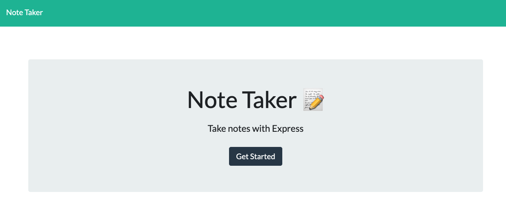
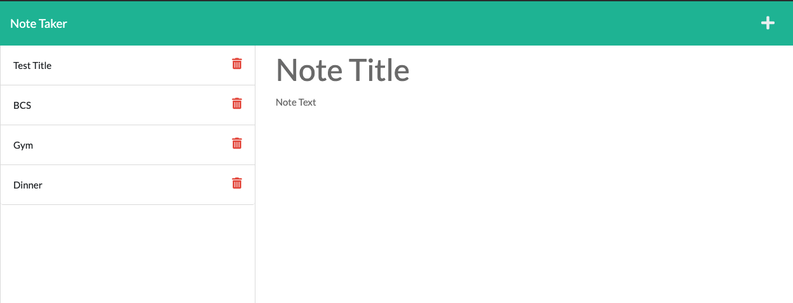

# Note Taker (Express.js application)

 Note Taker can be used to write and save notes. it uses an Express.js back end and will save and retrieve note data from a JSON file.

The application’s front end has already been created. 
My job was to build the back end, connect the two, and then deploy the entire application to Heroku.

## How the applications works

```
Open the Note Taker you find a landing page with a link to a notes page

WHEN you click on the link to the notes page it takes you to a page with existing notes listed in the left-hand column, plus empty fields to enter a new note title and the note’s text in the right-hand column

WHEN you enter a new note title and the note’s text a Save icon appears in the navigation at the top of the page

WHEN you click on the Save icon the new note I have entered is saved and appears in the left-hand column with the other existing notes

WHEN you click on an existing note in the list in the left-hand column, that note appears in the right-hand column

WHEN you click on the Write icon in the navigation at the top of the page you will be presented with empty fields to enter a new note title and the note’s text in the right-hand column

```


### The following images show the web application's appearance and functionality:







## Understand the flow 

* A `db.json` file is used to store and retrieve notes using the `fs` module.

* `GET /notes` return the `notes.html` file.

* `GET *` return the `index.html` file.

* `GET /api/notes` read the `db.json` file and return all saved notes as JSON.

* `POST /api/notes` receive a new note to save on the request body, add it to the `db.json` file, and then return the new note to the client. 

* `DELETE /api/notes/:id` receive a query parameter that contains the id of a note to delete. To delete a note, we read all notes from the `db.json` file, remove the note with the given `id` property, and then rewrite the notes to the `db.json` file.

